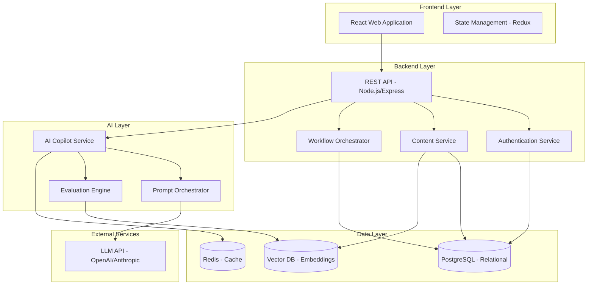
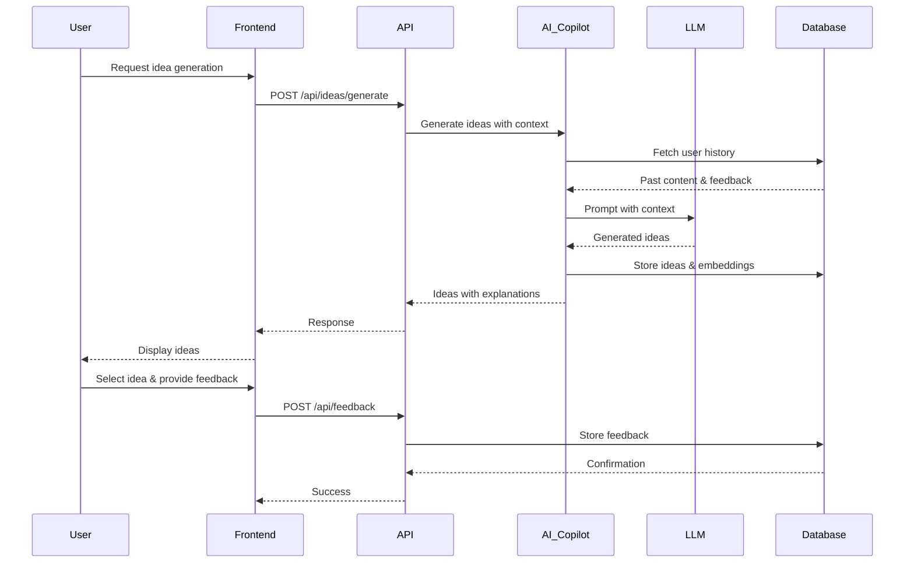

# Design Document: ContentOS

## Overview

### Problem Statement

Content creators face fragmented workflows across multiple tools for ideation, creation, optimization, and publishing. This fragmentation leads to:
- Context switching that breaks creative flow
- Inconsistent quality across platforms
- Difficulty learning from past performance
- Time-consuming manual repurposing
- Lack of actionable guidance during creation

### Solution Summary

ContentOS is an AI-powered platform that unifies the entire content lifecycle into a single, guided workflow. The system acts as an intelligent co-pilot that:
- Guides creators through a continuous improvement loop (Idea → Create → Repurpose → Optimize → Publish → Analyze → Improve)
- Provides explainable AI suggestions that preserve creator intent
- Learns from feedback to improve future recommendations
- Automates repurposing while maintaining message consistency
- Delivers actionable optimization insights

### Value Proposition

ContentOS reduces content creation time by 40% while improving engagement scores by 15 points through:
1. **Unified Workflow**: Single platform for the entire content lifecycle
2. **Intelligent Guidance**: AI co-pilot that explains suggestions and learns from feedback
3. **Automated Repurposing**: Transform content across platforms while preserving intent
4. **Continuous Improvement**: Feedback loop that makes the system smarter over time
5. **Creator Control**: Transparent AI that augments rather than replaces human creativity

## Architecture

### System Components



### Technology Stack

**Frontend:**
- React 18 with TypeScript
- Redux Toolkit for state management
- TailwindCSS for styling
- React Router for navigation
- Axios for API communication

**Backend:**
- Node.js with Express
- TypeScript
- JWT for authentication
- Zod for validation

**AI Layer:**
- OpenAI GPT-4 or Anthropic Claude API
- LangChain for prompt orchestration
- Custom evaluation logic

**Data Storage:**
- PostgreSQL for relational data (users, projects, content)
- Pinecone or Weaviate for vector embeddings
- Redis for caching and session management

**Infrastructure:**
- Docker for containerization
- Vercel/Netlify for frontend hosting
- Railway/Render for backend hosting
- GitHub Actions for CI/CD

### Data Flow



## Components and Interfaces

### 1. Idea & Planning Module

**Purpose:** Generate and organize content ideas with AI assistance.

**Key Components:**
- `IdeaGenerator`: Interfaces with AI to generate ideas based on context
- `IdeaLibrary`: Stores and organizes generated ideas
- `ContextBuilder`: Gathers user history and preferences for personalization

**API Endpoints:**
```typescript
POST /api/ideas/generate
  Body: { topic?: string, context?: string, projectId: string }
  Response: { ideas: Idea[], explanations: string[] }

GET /api/ideas/:projectId
  Response: { ideas: Idea[] }

POST /api/ideas/:ideaId/select
  Response: { contentId: string }
```

**Data Models:**
```typescript
interface Idea {
  id: string;
  projectId: string;
  title: string;
  description: string;
  rationale: string;
  createdAt: Date;
  selected: boolean;
}
```

### 2. Content Creation Studio

**Purpose:** Draft, edit, and refine content with AI co-pilot assistance.

**Key Components:**
- `ContentEditor`: Rich text editor with AI integration
- `SuggestionEngine`: Provides real-time AI suggestions
- `ToneController`: Manages persona and style consistency
- `VersionManager`: Tracks content versions and changes

**API Endpoints:**
```typescript
POST /api/content/create
  Body: { projectId: string, ideaId?: string, initialContent?: string }
  Response: { content: Content }

PUT /api/content/:contentId
  Body: { text: string, metadata: ContentMetadata }
  Response: { content: Content }

POST /api/content/:contentId/suggest
  Body: { action: 'expand' | 'refine' | 'rephrase', context: string }
  Response: { suggestions: Suggestion[], explanations: string[] }

POST /api/content/:contentId/apply-suggestion
  Body: { suggestionId: string }
  Response: { content: Content, newScore: number }
```

**Data Models:**
```typescript
interface Content {
  id: string;
  projectId: string;
  title: string;
  body: string;
  tone: string;
  persona: string;
  stage: LifecycleStage;
  createdAt: Date;
  updatedAt: Date;
  version: number;
}

interface Suggestion {
  id: string;
  type: 'expansion' | 'refinement' | 'rephrase';
  content: string;
  explanation: string;
  accepted: boolean;
}

type LifecycleStage = 
  | 'idea' 
  | 'draft' 
  | 'refine' 
  | 'optimize' 
  | 'repurpose' 
  | 'publish' 
  | 'analyze';
```

### 3. Repurposing Engine

**Purpose:** Transform content across different platform formats while preserving core message.

**Key Components:**
- `FormatAdapter`: Converts content to platform-specific formats
- `IntentPreserver`: Ensures core message remains consistent
- `PlatformRules`: Encodes platform-specific conventions and constraints

**API Endpoints:**
```typescript
GET /api/repurpose/formats
  Response: { formats: PlatformFormat[] }

POST /api/repurpose/:contentId
  Body: { targetFormat: string }
  Response: { 
    repurposedContent: Content, 
    changes: Change[], 
    explanation: string 
  }
```

**Data Models:**
```typescript
interface PlatformFormat {
  id: string;
  name: string;
  maxLength: number;
  structure: string;
  conventions: string[];
}

interface RepurposedContent extends Content {
  sourceContentId: string;
  targetFormat: string;
  transformations: string[];
}

interface Change {
  type: 'length' | 'structure' | 'style' | 'formatting';
  description: string;
  rationale: string;
}
```

**Supported Formats (MVP):**
1. Blog Post (long-form, 1000-2000 words)
2. Twitter Thread (280 chars per tweet, 5-10 tweets)
3. LinkedIn Article (professional tone, 500-1000 words)

### 4. Optimization Layer

**Purpose:** Score content quality and provide actionable improvement suggestions.

**Key Components:**
- `ScoreCalculator`: Computes engagement score based on multiple factors
- `SuggestionGenerator`: Creates specific, actionable recommendations
- `BestPracticesEngine`: Applies platform-specific optimization rules

**API Endpoints:**
```typescript
POST /api/optimize/:contentId/score
  Response: { 
    score: number, 
    breakdown: ScoreBreakdown, 
    suggestions: OptimizationSuggestion[] 
  }

POST /api/optimize/:contentId/apply
  Body: { suggestionId: string }
  Response: { updatedContent: Content, newScore: number }
```

**Data Models:**
```typescript
interface EngagementScore {
  overall: number; // 0-100
  breakdown: ScoreBreakdown;
  timestamp: Date;
}

interface ScoreBreakdown {
  clarity: number; // 0-100
  structure: number; // 0-100
  toneConsistency: number; // 0-100
  platformFit: number; // 0-100
  readability: number; // 0-100
}

interface OptimizationSuggestion {
  id: string;
  category: keyof ScoreBreakdown;
  description: string;
  explanation: string;
  impact: 'high' | 'medium' | 'low';
  actionable: string;
}
```

**Scoring Algorithm:**
```
Overall Score = (
  clarity * 0.25 +
  structure * 0.20 +
  toneConsistency * 0.20 +
  platformFit * 0.20 +
  readability * 0.15
)

Clarity: Sentence complexity, jargon usage, coherence
Structure: Logical flow, paragraph length, heading usage
Tone Consistency: Alignment with specified persona
Platform Fit: Adherence to platform conventions
Readability: Flesch reading ease, average sentence length
```

### 5. Publishing Interface

**Purpose:** Export and publish content with metadata tracking.

**Key Components:**
- `PublishManager`: Handles publication state and metadata
- `ExportFormatter`: Formats content for different export types
- `ClipboardHelper`: Provides copy-to-clipboard functionality

**API Endpoints:**
```typescript
POST /api/publish/:contentId
  Body: { format: 'markdown' | 'html' | 'plain' }
  Response: { 
    publishedContent: PublishedContent, 
    exportUrl: string 
  }

GET /api/publish/:contentId/export
  Query: { format: string }
  Response: { content: string, mimeType: string }
```

**Data Models:**
```typescript
interface PublishedContent extends Content {
  publishedAt: Date;
  exportFormat: string;
  platformTarget?: string;
}
```

### 6. Analytics & Learning Loop

**Purpose:** Track performance and incorporate feedback to improve future suggestions.

**Key Components:**
- `AnalyticsDashboard`: Displays performance metrics
- `FeedbackCollector`: Ingests manual or simulated performance data
- `LearningEngine`: Identifies patterns and updates AI context

**API Endpoints:**
```typescript
GET /api/analytics/:projectId
  Response: { 
    metrics: PerformanceMetrics, 
    insights: Insight[] 
  }

POST /api/analytics/:contentId/feedback
  Body: { 
    views?: number, 
    engagement?: number, 
    conversions?: number,
    qualitativeFeedback?: string 
  }
  Response: { success: boolean }

GET /api/analytics/insights
  Response: { 
    patterns: Pattern[], 
    recommendations: string[] 
  }
```

**Data Models:**
```typescript
interface PerformanceMetrics {
  contentId: string;
  views: number;
  engagement: number;
  conversions: number;
  engagementRate: number;
  qualitativeFeedback?: string;
  recordedAt: Date;
}

interface Insight {
  type: 'success_pattern' | 'improvement_area';
  description: string;
  evidence: string[];
  recommendation: string;
}

interface Pattern {
  characteristic: string;
  correlation: number;
  examples: string[];
}
```

### 7. Workflow Orchestrator

**Purpose:** Guide creators through the content lifecycle and suggest next steps.

**Key Components:**
- `StageManager`: Tracks current lifecycle stage
- `NextStepSuggester`: Recommends logical next actions
- `ProgressTracker`: Monitors completion of lifecycle stages

**API Endpoints:**
```typescript
GET /api/workflow/:contentId/status
  Response: { 
    currentStage: LifecycleStage, 
    completedStages: LifecycleStage[],
    nextSuggestion: string 
  }

POST /api/workflow/:contentId/advance
  Body: { targetStage: LifecycleStage }
  Response: { success: boolean, newStage: LifecycleStage }
```

## Data Models

### Core Entities

**User:**
```typescript
interface User {
  id: string;
  email: string;
  passwordHash: string;
  name: string;
  createdAt: Date;
  preferences: UserPreferences;
}

interface UserPreferences {
  defaultTone: string;
  defaultPersona: string;
  preferredFormats: string[];
}
```

**Project:**
```typescript
interface Project {
  id: string;
  userId: string;
  name: string;
  description: string;
  createdAt: Date;
  updatedAt: Date;
  archived: boolean;
  contentCount: number;
}
```

**Content (Full Schema):**
```typescript
interface Content {
  id: string;
  projectId: string;
  userId: string;
  title: string;
  body: string;
  tone: string;
  persona: string;
  stage: LifecycleStage;
  sourceContentId?: string; // For repurposed content
  targetFormat?: string;
  engagementScore?: EngagementScore;
  publishedAt?: Date;
  createdAt: Date;
  updatedAt: Date;
  version: number;
  metadata: ContentMetadata;
}

interface ContentMetadata {
  wordCount: number;
  readingTime: number;
  tags: string[];
  category?: string;
}
```

**Feedback:**
```typescript
interface Feedback {
  id: string;
  contentId: string;
  userId: string;
  type: 'suggestion_acceptance' | 'suggestion_rejection' | 'performance_data';
  data: Record<string, any>;
  createdAt: Date;
}
```

### Database Schema

**PostgreSQL Tables:**

```sql
-- Users table
CREATE TABLE users (
  id UUID PRIMARY KEY DEFAULT gen_random_uuid(),
  email VARCHAR(255) UNIQUE NOT NULL,
  password_hash VARCHAR(255) NOT NULL,
  name VARCHAR(255) NOT NULL,
  preferences JSONB DEFAULT '{}',
  created_at TIMESTAMP DEFAULT NOW()
);

-- Projects table
CREATE TABLE projects (
  id UUID PRIMARY KEY DEFAULT gen_random_uuid(),
  user_id UUID REFERENCES users(id) ON DELETE CASCADE,
  name VARCHAR(255) NOT NULL,
  description TEXT,
  archived BOOLEAN DEFAULT FALSE,
  created_at TIMESTAMP DEFAULT NOW(),
  updated_at TIMESTAMP DEFAULT NOW()
);

-- Content table
CREATE TABLE content (
  id UUID PRIMARY KEY DEFAULT gen_random_uuid(),
  project_id UUID REFERENCES projects(id) ON DELETE CASCADE,
  user_id UUID REFERENCES users(id) ON DELETE CASCADE,
  title VARCHAR(500) NOT NULL,
  body TEXT NOT NULL,
  tone VARCHAR(100),
  persona VARCHAR(100),
  stage VARCHAR(50) NOT NULL,
  source_content_id UUID REFERENCES content(id),
  target_format VARCHAR(100),
  engagement_score JSONB,
  published_at TIMESTAMP,
  created_at TIMESTAMP DEFAULT NOW(),
  updated_at TIMESTAMP DEFAULT NOW(),
  version INTEGER DEFAULT 1,
  metadata JSONB DEFAULT '{}'
);

-- Ideas table
CREATE TABLE ideas (
  id UUID PRIMARY KEY DEFAULT gen_random_uuid(),
  project_id UUID REFERENCES projects(id) ON DELETE CASCADE,
  title VARCHAR(500) NOT NULL,
  description TEXT NOT NULL,
  rationale TEXT NOT NULL,
  selected BOOLEAN DEFAULT FALSE,
  created_at TIMESTAMP DEFAULT NOW()
);

-- Feedback table
CREATE TABLE feedback (
  id UUID PRIMARY KEY DEFAULT gen_random_uuid(),
  content_id UUID REFERENCES content(id) ON DELETE CASCADE,
  user_id UUID REFERENCES users(id) ON DELETE CASCADE,
  type VARCHAR(100) NOT NULL,
  data JSONB NOT NULL,
  created_at TIMESTAMP DEFAULT NOW()
);

-- Performance metrics table
CREATE TABLE performance_metrics (
  id UUID PRIMARY KEY DEFAULT gen_random_uuid(),
  content_id UUID REFERENCES content(id) ON DELETE CASCADE,
  views INTEGER DEFAULT 0,
  engagement INTEGER DEFAULT 0,
  conversions INTEGER DEFAULT 0,
  engagement_rate DECIMAL(5,2),
  qualitative_feedback TEXT,
  recorded_at TIMESTAMP DEFAULT NOW()
);

-- Indexes
CREATE INDEX idx_projects_user_id ON projects(user_id);
CREATE INDEX idx_content_project_id ON content(project_id);
CREATE INDEX idx_content_user_id ON content(user_id);
CREATE INDEX idx_content_stage ON content(stage);
CREATE INDEX idx_feedback_content_id ON feedback(content_id);
CREATE INDEX idx_performance_content_id ON performance_metrics(content_id);
```

**Vector Database (Pinecone/Weaviate):**
- Store content embeddings for similarity search
- Enable learning from past successful content
- Support context-aware idea generation

```typescript
interface ContentEmbedding {
  contentId: string;
  embedding: number[]; // 1536-dim for OpenAI
  metadata: {
    userId: string;
    projectId: string;
    tone: string;
    engagementScore: number;
    performanceData?: PerformanceMetrics;
  };
}
```

## AI Design

### Prompt Orchestration

**Architecture:**
The AI Copilot uses a modular prompt system with:
1. **System Prompts**: Define AI role and behavior
2. **Context Injection**: Add user history and preferences
3. **Task-Specific Prompts**: Tailored for each operation
4. **Explanation Generation**: Always include reasoning

**Prompt Templates:**

```typescript
// Idea Generation Prompt
const ideaGenerationPrompt = `
You are an AI content co-pilot helping creators generate ideas.

User Context:
- Past successful topics: ${pastTopics}
- Preferred tone: ${userTone}
- Target audience: ${audience}

Task: Generate 5 diverse content ideas about "${topic}".

For each idea:
1. Provide a compelling title
2. Write a 2-sentence description
3. Explain why this idea would resonate with the audience

Format as JSON array.
`;

// Content Refinement Prompt
const refinementPrompt = `
You are an AI content co-pilot helping refine content.

Original Content:
${originalContent}

User Request: ${userRequest}

Task: Suggest improvements while preserving the creator's voice and intent.

Provide:
1. Specific suggestions with line references
2. Explanation for each suggestion
3. Expected impact on engagement

Maintain the creator's core message and style.
`;

// Repurposing Prompt
const repurposingPrompt = `
You are an AI content co-pilot transforming content for different platforms.

Source Content:
${sourceContent}

Target Platform: ${targetPlatform}
Platform Constraints:
- Max length: ${maxLength}
- Structure: ${structure}
- Conventions: ${conventions}

Task: Transform the content while preserving the core message.

Provide:
1. Repurposed content
2. List of changes made
3. Explanation for each transformation

Ensure the essence and intent remain intact.
`;
```

### Persona & Tone Control

**Tone Presets (MVP):**
1. **Professional**: Formal, authoritative, data-driven
2. **Conversational**: Friendly, approachable, relatable
3. **Educational**: Clear, structured, informative
4. **Inspirational**: Motivational, aspirational, emotional
5. **Technical**: Precise, detailed, expert-level

**Implementation:**
```typescript
interface ToneProfile {
  name: string;
  systemPrompt: string;
  vocabulary: string[];
  sentenceStructure: string;
  examples: string[];
}

const toneProfiles: Record<string, ToneProfile> = {
  professional: {
    name: "Professional",
    systemPrompt: "Write in a formal, authoritative tone. Use data and evidence. Avoid casual language.",
    vocabulary: ["leverage", "optimize", "strategic", "implement"],
    sentenceStructure: "Complex sentences with subordinate clauses",
    examples: [...]
  },
  // ... other profiles
};
```

### Evaluation & Scoring Logic

**Clarity Score (0-100):**
```typescript
function calculateClarityScore(content: string): number {
  const sentences = splitIntoSentences(content);
  const avgWordsPerSentence = calculateAvgWords(sentences);
  const jargonCount = countJargon(content);
  const coherenceScore = analyzeCoherence(content);
  
  // Optimal: 15-20 words per sentence
  const lengthScore = 100 - Math.abs(avgWordsPerSentence - 17.5) * 3;
  const jargonPenalty = Math.min(jargonCount * 5, 30);
  
  return Math.max(0, Math.min(100, 
    (lengthScore * 0.4) + 
    (coherenceScore * 0.4) - 
    jargonPenalty + 
    20
  ));
}
```

**Structure Score (0-100):**
```typescript
function calculateStructureScore(content: string): number {
  const paragraphs = splitIntoParagraphs(content);
  const hasIntro = detectIntroduction(paragraphs[0]);
  const hasConclusion = detectConclusion(paragraphs[paragraphs.length - 1]);
  const avgParagraphLength = calculateAvgParagraphLength(paragraphs);
  const hasHeadings = detectHeadings(content);
  
  let score = 0;
  if (hasIntro) score += 25;
  if (hasConclusion) score += 25;
  if (avgParagraphLength >= 3 && avgParagraphLength <= 6) score += 25;
  if (hasHeadings) score += 25;
  
  return score;
}
```

**Tone Consistency Score (0-100):**
```typescript
async function calculateToneConsistencyScore(
  content: string, 
  targetTone: string
): Promise<number> {
  // Use LLM to evaluate tone consistency
  const prompt = `
    Evaluate if the following content maintains a ${targetTone} tone consistently.
    Rate from 0-100 where 100 is perfectly consistent.
    
    Content: ${content}
    
    Provide: score and brief explanation.
  `;
  
  const response = await llm.complete(prompt);
  return parseScore(response);
}
```

**Platform Fit Score (0-100):**
```typescript
function calculatePlatformFitScore(
  content: string, 
  format: PlatformFormat
): number {
  const wordCount = countWords(content);
  const lengthScore = evaluateLengthFit(wordCount, format.maxLength);
  const structureScore = evaluateStructureFit(content, format.structure);
  const conventionScore = evaluateConventions(content, format.conventions);
  
  return (lengthScore * 0.4) + (structureScore * 0.3) + (conventionScore * 0.3);
}
```

**Readability Score (0-100):**
```typescript
function calculateReadabilityScore(content: string): number {
  const fleschScore = calculateFleschReadingEase(content);
  // Flesch: 60-70 is optimal (8th-9th grade level)
  // Convert to 0-100 scale
  return Math.max(0, Math.min(100, fleschScore));
}

function calculateFleschReadingEase(content: string): number {
  const sentences = splitIntoSentences(content);
  const words = splitIntoWords(content);
  const syllables = countSyllables(content);
  
  const avgWordsPerSentence = words.length / sentences.length;
  const avgSyllablesPerWord = syllables / words.length;
  
  return 206.835 - 
         (1.015 * avgWordsPerSentence) - 
         (84.6 * avgSyllablesPerWord);
}
```

### Learning from Feedback

**Feedback Integration:**
```typescript
async function incorporateFeedback(
  contentId: string, 
  feedback: Feedback
): Promise<void> {
  // Store feedback
  await db.feedback.create(feedback);
  
  // Update content embedding with performance data
  if (feedback.type === 'performance_data') {
    const content = await db.content.findById(contentId);
    const embedding = await generateEmbedding(content.body);
    
    await vectorDB.upsert({
      id: contentId,
      embedding,
      metadata: {
        ...content.metadata,
        performanceData: feedback.data,
        engagementScore: content.engagementScore
      }
    });
  }
  
  // Analyze patterns periodically
  await analyzePerformancePatterns(feedback.userId);
}

async function analyzePerformancePatterns(userId: string): Promise<Pattern[]> {
  // Query high-performing content
  const topContent = await vectorDB.query({
    filter: {
      userId,
      'metadata.performanceData.engagementRate': { $gte: 5.0 }
    },
    topK: 20
  });
  
  // Extract common characteristics
  const patterns = extractPatterns(topContent);
  
  // Store insights for future use
  await db.insights.upsert({ userId, patterns });
  
  return patterns;
}
```

### Caching Strategy

**Prompt Caching:**
```typescript
// Cache system prompts and user context
const cacheKey = `prompt:${userId}:${operation}`;
const cachedPrompt = await redis.get(cacheKey);

if (cachedPrompt) {
  return cachedPrompt;
}

const prompt = buildPrompt(userId, operation);
await redis.setex(cacheKey, 3600, prompt); // 1 hour TTL
return prompt;
```

**Response Caching:**
```typescript
// Cache similar requests
const requestHash = hashRequest({ operation, content, parameters });
const cachedResponse = await redis.get(`response:${requestHash}`);

if (cachedResponse) {
  return JSON.parse(cachedResponse);
}

const response = await llm.complete(prompt);
await redis.setex(`response:${requestHash}`, 1800, JSON.stringify(response));
return response;
```


## Correctness Properties

*A property is a characteristic or behavior that should hold true across all valid executions of a system—essentially, a formal statement about what the system should do. Properties serve as the bridge between human-readable specifications and machine-verifiable correctness guarantees.*

### Property 1: User Registration Creates Valid Accounts

*For any* valid email and password combination, registering a new user should create an account with all required fields (id, email, passwordHash, name, createdAt, preferences) properly initialized.

**Validates: Requirements 1.1**

### Property 2: Authentication Correctness

*For any* user account, authentication should succeed if and only if the provided credentials match the stored credentials. Invalid credentials should always be rejected with an appropriate error message.

**Validates: Requirements 1.2, 1.3**

### Property 3: Password Reset Token Generation

*For any* registered user email, requesting a password reset should generate a unique, secure reset token that is stored and associated with that user account.

**Validates: Requirements 1.4**

### Property 4: Session Expiration Enforcement

*For any* expired session token, all protected operations should be rejected and require re-authentication.

**Validates: Requirements 1.5**

### Property 5: Project Creation Completeness

*For any* valid project name and description, creating a new project should initialize a Content_Project with all required fields (id, userId, name, description, createdAt, updatedAt, archived=false).

**Validates: Requirements 2.1**

### Property 6: Project Ordering by Modification Date

*For any* set of projects belonging to a user, retrieving the project list should return them ordered by updatedAt in descending order (most recently modified first).

**Validates: Requirements 2.2**

### Property 7: Cascade Deletion of Projects

*For any* project with associated content, deleting the project should remove both the project and all its associated content pieces from the database.

**Validates: Requirements 2.3**

### Property 8: Project Archival Preserves Content

*For any* project with content, archiving the project should set archived=true while preserving all associated content pieces unchanged.

**Validates: Requirements 2.5**

### Property 9: Idea Generation Count and Relevance

*For any* idea generation request with optional topic context, the AI_Copilot should generate at least 5 ideas, and if a topic is provided, all ideas should relate to that topic domain.

**Validates: Requirements 3.1, 3.2**

### Property 10: Idea Selection Creates Content

*For any* selected idea, the system should create a new content piece with the idea's title and description, linked to the current project, with stage='idea'.

**Validates: Requirements 3.3**

### Property 11: AI Explainability for All Suggestions

*For any* AI-generated suggestion (ideas, refinements, repurposing, optimizations), the response should include a non-empty explanation field describing the rationale.

**Validates: Requirements 3.4, 4.3, 5.4, 6.5, 10.1, 10.3**

### Property 12: Tone Consistency in AI Operations

*For any* content operation (expansion, refinement, repurposing) with a specified tone, the AI output should match the specified tone profile as measured by tone consistency scoring.

**Validates: Requirements 4.2, 4.4**

### Property 13: Data Persistence Round Trip

*For any* data modification operation (project update, content save, feedback submission), the data should be persisted to the database such that immediately querying for that data returns the modified values.

**Validates: Requirements 2.4, 4.5, 7.5, 8.2, 12.2**

### Property 14: Repurposing Platform Constraints

*For any* content repurposed to a target platform format, the output should satisfy that platform's constraints (maxLength, structure requirements) while maintaining a link to the source content via sourceContentId.

**Validates: Requirements 5.2, 5.3, 5.5**

### Property 15: Engagement Score Bounds and Breakdown

*For any* content optimization analysis, the engagement score should be between 0 and 100 (inclusive), and the score breakdown should include all five components (clarity, structure, toneConsistency, platformFit, readability).

**Validates: Requirements 6.1, 6.4, 10.2**

### Property 16: Optimization Suggestions Are Actionable

*For any* optimization analysis, the system should provide at least one specific, actionable suggestion with a non-empty description and explanation.

**Validates: Requirements 6.2**

### Property 17: Score Recalculation After Optimization

*For any* content piece, applying an optimization suggestion should trigger a recalculation of the engagement score, resulting in a new score value.

**Validates: Requirements 6.3**

### Property 18: Publishing State Transition

*For any* content marked as ready to publish, the system should update the stage to 'publish', set publishedAt to the current timestamp, and record a publication event.

**Validates: Requirements 7.1, 7.5**

### Property 19: Export Format Correctness

*For any* content export request with a specified format (plain, markdown, html), the system should return the content in that format with appropriate MIME type.

**Validates: Requirements 7.2**

### Property 20: Publishing Preserves Data

*For any* content piece, publishing should not modify the title, body, or metadata fields—all data should remain unchanged except for stage and publishedAt.

**Validates: Requirements 7.3**

### Property 21: Analytics Data Association

*For any* performance feedback input, the data should be stored in the database with correct association to the content piece via contentId.

**Validates: Requirements 8.2**

### Property 22: Analytics Retrieval for Published Content

*For any* published content with associated performance metrics, viewing analytics should return all recorded metrics for that content.

**Validates: Requirements 8.1**

### Property 23: Workflow Stage Tracking

*For any* content piece, the system should accurately track and display its current lifecycle stage, and the stage should be one of the valid LifecycleStage values.

**Validates: Requirements 9.3**

### Property 24: Workflow Stage Transitions Preserve Content

*For any* content piece, advancing from one lifecycle stage to another should preserve the title, body, and all metadata—only the stage field should change.

**Validates: Requirements 9.4**

### Property 25: Next Stage Suggestion Correctness

*For any* content at a given lifecycle stage, the system should suggest a valid next stage that follows the logical workflow progression (idea → draft → refine → optimize → repurpose → publish → analyze).

**Validates: Requirements 9.2**

### Property 26: Error Handling with Retry

*For any* failed AI operation, the system should return a clear error message and, for save operations specifically, retry up to 3 times before reporting failure.

**Validates: Requirements 11.5, 12.3**

### Property 27: State Restoration Round Trip

*For any* project state, saving the project and then reloading it should restore the exact same state (all content, metadata, and relationships preserved).

**Validates: Requirements 12.5**

### Property 28: Helpful Error Messages

*For any* error condition (validation failure, operation failure), the system should provide a non-empty, descriptive error message that helps the user understand what went wrong.

**Validates: Requirements 13.4**


## Error Handling

### Error Categories

**1. Authentication Errors:**
- Invalid credentials (401 Unauthorized)
- Expired session (401 Unauthorized)
- Missing authentication token (401 Unauthorized)
- Invalid reset token (400 Bad Request)

**2. Validation Errors:**
- Missing required fields (400 Bad Request)
- Invalid email format (400 Bad Request)
- Password too weak (400 Bad Request)
- Content exceeds platform limits (400 Bad Request)

**3. Resource Errors:**
- Project not found (404 Not Found)
- Content not found (404 Not Found)
- User not found (404 Not Found)
- Unauthorized access to resource (403 Forbidden)

**4. AI Service Errors:**
- LLM API rate limit exceeded (429 Too Many Requests)
- LLM API timeout (504 Gateway Timeout)
- LLM API error (502 Bad Gateway)
- Invalid AI response format (500 Internal Server Error)

**5. Database Errors:**
- Connection failure (503 Service Unavailable)
- Query timeout (504 Gateway Timeout)
- Constraint violation (409 Conflict)
- Transaction failure (500 Internal Server Error)

### Error Response Format

All API errors follow a consistent format:

```typescript
interface ErrorResponse {
  error: {
    code: string;
    message: string;
    details?: Record<string, any>;
    timestamp: string;
  };
}
```

**Example:**
```json
{
  "error": {
    "code": "INVALID_CREDENTIALS",
    "message": "The email or password you entered is incorrect. Please try again.",
    "timestamp": "2024-01-15T10:30:00Z"
  }
}
```

### Error Handling Strategies

**1. Graceful Degradation:**
- If AI service is unavailable, allow manual content creation
- If vector DB is down, skip similarity search
- If cache is unavailable, fetch from primary database

**2. Retry Logic:**
- Automatic retry for transient failures (3 attempts with exponential backoff)
- Applies to: database connections, LLM API calls, external services
- Does not apply to: validation errors, authentication errors

**3. User-Friendly Messages:**
- Technical errors are translated to user-friendly language
- Provide actionable guidance when possible
- Never expose internal system details or stack traces

**4. Logging and Monitoring:**
- All errors logged with context (userId, operation, timestamp)
- Critical errors trigger alerts
- Error rates monitored for anomaly detection

**5. Fallback Behaviors:**
```typescript
// Example: AI service fallback
async function generateIdeas(context: string): Promise<Idea[]> {
  try {
    return await aiService.generateIdeas(context);
  } catch (error) {
    if (error instanceof RateLimitError) {
      // Return cached suggestions
      return await getCachedIdeas(context);
    } else if (error instanceof TimeoutError) {
      // Return template-based ideas
      return generateTemplateIdeas(context);
    } else {
      // Log and rethrow
      logger.error('Idea generation failed', { error, context });
      throw new ServiceUnavailableError(
        'Unable to generate ideas at this time. Please try again in a moment.'
      );
    }
  }
}
```

### Circuit Breaker Pattern

For external services (LLM API), implement circuit breaker to prevent cascade failures:

```typescript
class CircuitBreaker {
  private failureCount = 0;
  private lastFailureTime?: Date;
  private state: 'closed' | 'open' | 'half-open' = 'closed';
  
  async execute<T>(operation: () => Promise<T>): Promise<T> {
    if (this.state === 'open') {
      if (this.shouldAttemptReset()) {
        this.state = 'half-open';
      } else {
        throw new ServiceUnavailableError('Service temporarily unavailable');
      }
    }
    
    try {
      const result = await operation();
      this.onSuccess();
      return result;
    } catch (error) {
      this.onFailure();
      throw error;
    }
  }
  
  private onSuccess() {
    this.failureCount = 0;
    this.state = 'closed';
  }
  
  private onFailure() {
    this.failureCount++;
    this.lastFailureTime = new Date();
    
    if (this.failureCount >= 5) {
      this.state = 'open';
    }
  }
  
  private shouldAttemptReset(): boolean {
    if (!this.lastFailureTime) return false;
    const timeSinceFailure = Date.now() - this.lastFailureTime.getTime();
    return timeSinceFailure > 60000; // 1 minute
  }
}
```

## Testing Strategy

### Overview

ContentOS employs a dual testing approach combining unit tests for specific examples and edge cases with property-based tests for universal correctness properties. This ensures both concrete bug detection and comprehensive input coverage.

### Testing Layers

**1. Unit Tests:**
- Focus on specific examples and edge cases
- Test individual functions and components in isolation
- Verify error conditions and boundary cases
- Fast execution for rapid feedback

**2. Property-Based Tests:**
- Verify universal properties across randomized inputs
- Test invariants and correctness properties from design document
- Run minimum 100 iterations per property
- Catch edge cases that manual tests might miss

**3. Integration Tests:**
- Test interactions between components
- Verify API contracts and data flow
- Test database transactions and rollbacks
- Validate end-to-end workflows

**4. End-to-End Tests:**
- Test complete user workflows through UI
- Verify critical paths (registration → project creation → content creation → publishing)
- Run against staging environment
- Limited number due to execution time

### Property-Based Testing Configuration

**Library Selection:**
- **JavaScript/TypeScript**: fast-check
- **Python**: Hypothesis

**Configuration:**
```typescript
import fc from 'fast-check';

// Example property test configuration
describe('Content Creation Properties', () => {
  it('Property 13: Data Persistence Round Trip', () => {
    fc.assert(
      fc.property(
        fc.record({
          title: fc.string({ minLength: 1, maxLength: 500 }),
          body: fc.string({ minLength: 1, maxLength: 10000 }),
          tone: fc.constantFrom('professional', 'conversational', 'educational'),
        }),
        async (contentData) => {
          // Feature: content-os, Property 13: Data Persistence Round Trip
          const saved = await contentService.create(contentData);
          const retrieved = await contentService.findById(saved.id);
          
          expect(retrieved.title).toBe(contentData.title);
          expect(retrieved.body).toBe(contentData.body);
          expect(retrieved.tone).toBe(contentData.tone);
        }
      ),
      { numRuns: 100 } // Minimum 100 iterations
    );
  });
});
```

**Tagging Convention:**
Each property test must include a comment tag referencing the design document:
```typescript
// Feature: content-os, Property {number}: {property_text}
```

### Test Coverage Goals

**Unit Tests:**
- 80% code coverage minimum
- 100% coverage for critical paths (authentication, data persistence)
- All error conditions tested
- All edge cases documented in requirements

**Property Tests:**
- One property test per correctness property in design document
- 100 iterations minimum per property
- Cover all CRUD operations
- Cover all AI operations with mocked LLM responses

**Integration Tests:**
- All API endpoints tested
- All database operations tested
- All service interactions tested
- Authentication and authorization flows tested

### Testing Approach by Component

**1. Authentication Service:**
- Unit tests: Valid/invalid credentials, password hashing, token generation
- Property tests: Property 2 (Authentication Correctness), Property 3 (Token Generation)
- Edge cases: Empty passwords, SQL injection attempts, XSS in email

**2. Content Service:**
- Unit tests: CRUD operations, validation, state transitions
- Property tests: Property 13 (Persistence), Property 24 (Stage Transitions), Property 27 (State Restoration)
- Edge cases: Empty content, maximum length content, special characters

**3. AI Copilot Service:**
- Unit tests: Prompt construction, response parsing, error handling
- Property tests: Property 9 (Idea Generation), Property 11 (Explainability), Property 12 (Tone Consistency)
- Mocking: Mock LLM API responses for deterministic testing
- Edge cases: Empty context, very long context, API failures

**4. Repurposing Engine:**
- Unit tests: Format conversion, length adaptation, structure transformation
- Property tests: Property 14 (Platform Constraints)
- Edge cases: Content exceeding platform limits, unsupported formats

**5. Optimization Layer:**
- Unit tests: Score calculation components, suggestion generation
- Property tests: Property 15 (Score Bounds), Property 17 (Score Recalculation)
- Edge cases: Empty content, single-word content, very long content

**6. Workflow Orchestrator:**
- Unit tests: Stage transitions, next step suggestions
- Property tests: Property 23 (Stage Tracking), Property 25 (Next Stage Suggestion)
- Edge cases: Invalid stage transitions, circular workflows

### Mocking Strategy

**LLM API Mocking:**
```typescript
// Mock LLM responses for deterministic testing
class MockLLMService implements LLMService {
  async complete(prompt: string): Promise<string> {
    if (prompt.includes('generate ideas')) {
      return JSON.stringify([
        { title: 'Idea 1', description: 'Description 1', rationale: 'Rationale 1' },
        { title: 'Idea 2', description: 'Description 2', rationale: 'Rationale 2' },
        // ... 5 total ideas
      ]);
    }
    
    if (prompt.includes('refine content')) {
      return JSON.stringify({
        suggestions: [
          { content: 'Improved version', explanation: 'Why this is better' }
        ]
      });
    }
    
    // Default response
    return 'Mock LLM response';
  }
}
```

**Database Mocking:**
- Use in-memory SQLite for unit tests
- Use test database for integration tests
- Reset database state between tests
- Use transactions with rollback for test isolation

### Continuous Integration

**CI Pipeline:**
1. Lint and format check
2. Unit tests (parallel execution)
3. Property tests (parallel execution)
4. Integration tests (sequential)
5. Build and deploy to staging
6. E2E tests against staging
7. Deploy to production (manual approval)

**Test Execution Time Targets:**
- Unit tests: < 2 minutes
- Property tests: < 5 minutes
- Integration tests: < 5 minutes
- E2E tests: < 10 minutes
- Total CI pipeline: < 25 minutes

### Test Data Generation

**Generators for Property Tests:**
```typescript
// User generator
const userGen = fc.record({
  email: fc.emailAddress(),
  password: fc.string({ minLength: 8, maxLength: 100 }),
  name: fc.string({ minLength: 1, maxLength: 255 }),
});

// Project generator
const projectGen = fc.record({
  name: fc.string({ minLength: 1, maxLength: 255 }),
  description: fc.string({ maxLength: 1000 }),
});

// Content generator
const contentGen = fc.record({
  title: fc.string({ minLength: 1, maxLength: 500 }),
  body: fc.string({ minLength: 1, maxLength: 10000 }),
  tone: fc.constantFrom('professional', 'conversational', 'educational', 'inspirational', 'technical'),
  stage: fc.constantFrom('idea', 'draft', 'refine', 'optimize', 'repurpose', 'publish', 'analyze'),
});

// Platform format generator
const platformFormatGen = fc.constantFrom('blog-post', 'twitter-thread', 'linkedin-article');
```

## Non-Goals (Out of Scope for MVP)

The following features are explicitly excluded from the MVP to maintain focus on core workflow:

### 1. Real-Time Collaboration
- Multi-user editing
- Presence indicators
- Conflict resolution
- Commenting and annotations

### 2. Direct Platform Publishing
- OAuth integration with social media platforms
- Automated posting to Twitter, LinkedIn, Medium
- Platform-specific API integrations
- Scheduled publishing

### 3. Advanced Analytics
- Automated performance data collection from platforms
- Trend analysis and forecasting
- Competitor analysis
- A/B testing framework

### 4. Advanced SEO Tools
- Keyword research
- Search volume analysis
- Backlink tracking
- SERP position monitoring

### 5. Rich Media Support
- Image generation and editing
- Video content creation
- Audio content support
- Media library management

### 6. Team Features
- Role-based access control
- Team workspaces
- Approval workflows
- Activity feeds

### 7. Monetization Features
- Payment processing
- Subscription management
- Content gating
- Affiliate tracking

### 8. Mobile Applications
- Native iOS app
- Native Android app
- Offline mode
- Push notifications

### 9. Third-Party Integrations
- Zapier integration
- Webhook support
- API for external tools
- Import from other platforms

### 10. Advanced AI Features
- Custom model fine-tuning
- Multi-modal AI (image + text)
- Voice-to-text
- AI-generated images

### Rationale

These features are excluded to:
1. **Reduce complexity**: Focus on core workflow loop
2. **Minimize dependencies**: Avoid external API integrations that could fail
3. **Control costs**: Limit LLM API usage and infrastructure requirements
4. **Accelerate delivery**: Ship MVP within hackathon timeframe
5. **Validate core value**: Prove the workflow concept before adding features

These features may be considered for future iterations based on user feedback and MVP success metrics.
